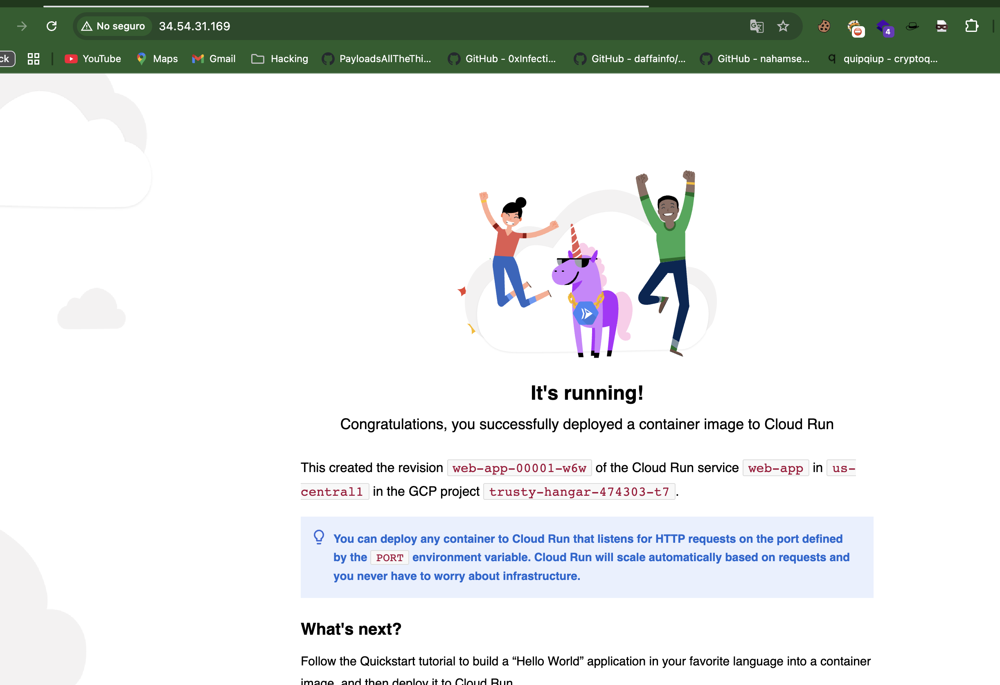
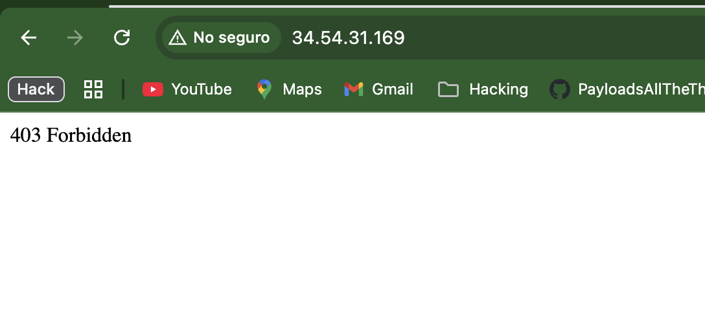
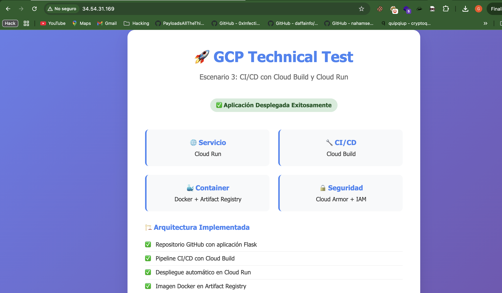

# 🚀 Escenario 3: Ejercicio Práctico Completo con CI/CD y Seguridad

## 📋 Descripción del Proyecto

Este proyecto implementa una aplicación web completa en Google Cloud Platform (GCP) utilizando **Cloud Build**, **Cloud Run**, **Cloud Armor** y **Terraform** para crear un pipeline de CI/CD con medidas de seguridad avanzadas.

## 🏗️ Arquitectura Implementada

```
┌─────────────────┐    ┌──────────────────┐    ┌─────────────────┐
│   GitHub Repo   │───▶│   Cloud Build    │───▶│  Artifact Reg.  │
│  (Source Code)  │    │   (CI/CD)        │    │  (Docker Images)│
└─────────────────┘    └──────────────────┘    └─────────────────┘
                                │
                                ▼
┌─────────────────┐    ┌──────────────────┐    ┌─────────────────┐
│  Cloud Armor    │◀───│  Load Balancer   │◀───│   Cloud Run     │
│ (Security WAF)  │    │   (HTTP/HTTPS)   │    │  (Web App)      │
└─────────────────┘    └──────────────────┘    └─────────────────┘
```

## 🛠️ Componentes Implementados

### 1. **Aplicación Web (Flask)**
- **Archivo**: `app.py`
- **Framework**: Flask con Python 3.9
- **Puerto**: 8080
- **Endpoints**:
  - `/` - Página principal
  - `/health` - Health check
  - `/info` - Información de la aplicación

### 2. **Containerización**
- **Archivo**: `Dockerfile`
- **Base Image**: Python 3.9-slim-buster
- **Multi-stage build** para optimización
- **Web Server**: Gunicorn

### 3. **Infraestructura como Código (Terraform)**
- **Archivo**: `main.tf`
- **Recursos creados**:
  - Cloud Run Service
  - Artifact Registry Repository
  - Cloud Armor Security Policy
  - Load Balancer (HTTP)
  - Cloud Build Trigger
  - Service Account con permisos específicos

### 4. **CI/CD Pipeline**
- **Archivo**: `cloudbuild.yaml`
- **Trigger**: Push a rama `main`
- **Pasos**:
  1. Build de imagen Docker
  2. Push a Artifact Registry
  3. Deploy a Cloud Run
  4. Update de tráfico

### 5. **Seguridad (Cloud Armor)**
- **Política de seguridad** personalizada
- **Bloqueo de IP específica**: `186.169.36.153`
- **Reglas de seguridad** configuradas

## 🌐 URLs y Accesos

### **URLs de la Aplicación**
- **Cloud Run Directo**: https://web-app-uzwpjyfbzq-uc.a.run.app
- **Load Balancer con Cloud Armor**: http://34.54.31.169

### **URLs de Gestión**
- **Cloud Build Console**: https://console.cloud.google.com/cloud-build/builds
- **Cloud Run Console**: https://console.cloud.google.com/run/detail/us-central1/web-app
- **Cloud Armor Console**: https://console.cloud.google.com/security/armor

## 🔒 Evidencias de Seguridad (Cloud Armor)

### **1. Configuración de Cloud Armor**


### **2. Bloqueo de IP Verificado**


**Resultado del bloqueo:**
```bash
$ curl -I http://34.54.31.169
HTTP/1.1 403 Forbidden
Content-Length: 134
Content-Type: text/html; charset=UTF-8
```

## 🚀 Evidencias de CI/CD (Cloud Build)

### **Pipeline de Cloud Build Ejecutándose**


**Build exitoso con:**
- ✅ Construcción de imagen Docker
- ✅ Push a Artifact Registry
- ✅ Deploy a Cloud Run
- ✅ Actualización de tráfico

## 📁 Estructura del Repositorio

```
poc2/
├── app.py                 # Aplicación Flask
├── Dockerfile            # Configuración de contenedor
├── requirements.txt      # Dependencias de Python
├── cloudbuild.yaml       # Pipeline de CI/CD
├── main.tf              # Infraestructura como código
├── terraform.tfvars     # Variables de configuración
├── .gitignore           # Archivos ignorados por Git
├── README.md            # Esta documentación
└── results/             # Evidencias y capturas
    ├── app-cloud-build.png
    ├── armor-block.png
    └── armor.png
```

## 🚀 Instrucciones de Despliegue

### **Prerrequisitos**
1. Cuenta de Google Cloud Platform
2. Terraform instalado
3. gcloud CLI configurado
4. Repositorio GitHub conectado a Cloud Build

### **1. Configurar Variables**
```bash
# Editar terraform.tfvars
project_id = "tu-project-id"
github_owner = "tu-usuario-github"
github_repo = "tu-repositorio"
blocked_ip = "IP-a-bloquear"
```

### **2. Desplegar Infraestructura**
```bash
# Inicializar Terraform
terraform init

# Validar configuración
terraform validate

# Ver plan de despliegue
terraform plan

# Aplicar cambios
terraform apply
```

### **3. Conectar Repositorio GitHub**
1. Ir a Cloud Build Console
2. Conectar repositorio GitHub
3. Configurar trigger para rama `main`

### **4. Probar CI/CD**
```bash
# Hacer cambios y push
git add .
git commit -m "Test CI/CD pipeline"
git push origin main
```

## 🔧 Configuración Técnica

### **Variables de Entorno**
- `ENVIRONMENT`: production
- `VERSION`: ${SHORT_SHA} (hash del commit)
- `PORT`: 8080

### **Recursos de GCP Creados**
- **Cloud Run Service**: `web-app`
- **Artifact Registry**: `gcp-technical-test`
- **Cloud Armor Policy**: `web-app-security-policy`
- **Load Balancer**: `web-app-forwarding-rule`
- **Service Account**: `cloud-build-sa`

### **Permisos del Service Account**
- `roles/run.admin`
- `roles/artifactregistry.writer`
- `roles/iam.serviceAccountUser`
- `roles/compute.securityAdmin`
- `roles/logging.logWriter`

## 🧪 Pruebas Realizadas

### **1. Funcionalidad de la Aplicación**
```bash
# Test de conectividad
curl -I http://34.54.31.169
# Resultado: HTTP/1.1 200 OK

# Test de contenido
curl http://34.54.31.169
# Resultado: Página HTML de la aplicación
```

### **2. Seguridad (Cloud Armor)**
```bash
# Test desde IP bloqueada
curl -I http://34.54.31.169
# Resultado: HTTP/1.1 403 Forbidden
```

### **3. CI/CD Pipeline**
- ✅ Build automático en push a `main`
- ✅ Deploy automático a Cloud Run
- ✅ Actualización de imagen en Artifact Registry

## 📊 Métricas y Monitoreo

### **Cloud Run**
- **CPU**: 1 vCPU
- **Memoria**: 1GB
- **Instancias**: 0-10 (auto-scaling)
- **Timeout**: 300 segundos

### **Cloud Armor**
- **Política**: `web-app-security-policy`
- **IP Bloqueada**: `186.169.36.153`
- **Acción**: `deny(403)`

## 🧹 Limpieza de Recursos

```bash
# Destruir todos los recursos
terraform destroy

# Confirmar destrucción
yes
```

## 📈 Beneficios Implementados

1. **Infraestructura como Código**: Todo versionado y reproducible
2. **CI/CD Automatizado**: Deploy automático en cada push
3. **Seguridad Avanzada**: Cloud Armor protegiendo la aplicación
4. **Escalabilidad**: Cloud Run con auto-scaling
5. **Monitoreo**: Logs centralizados en Cloud Logging
6. **Alta Disponibilidad**: Load Balancer con múltiples regiones

## 🎯 Objetivos Cumplidos

- ✅ **Despliegue automatizado** con Cloud Build y Cloud Run
- ✅ **Seguridad implementada** con Cloud Armor
- ✅ **Infraestructura como código** con Terraform
- ✅ **Pipeline de CI/CD** funcional
- ✅ **Documentación completa** con evidencias
- ✅ **Aplicación web** funcionando correctamente

## 📞 Soporte

Para cualquier consulta o problema:
1. Revisar los logs de Cloud Build
2. Verificar configuración de Cloud Armor
3. Comprobar estado de Cloud Run
4. Consultar documentación de GCP

---

**Proyecto**: Escenario 3 - GCP Technical Test  
**Fecha**: Octubre 2025  
**Tecnologías**: GCP, Terraform, Cloud Build, Cloud Run, Cloud Armor, Flask, Docker